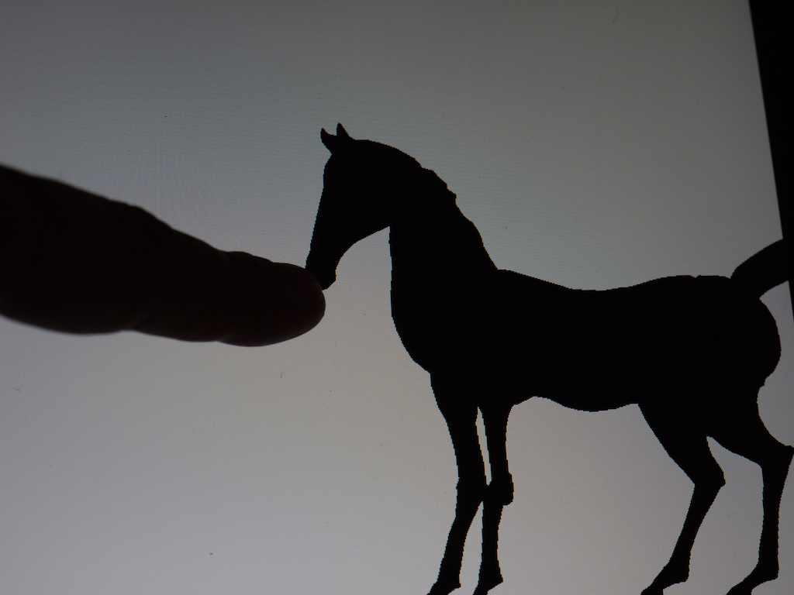

# PhD Projects - ShadowEngine 002 2010-2012 #

Software: Unity 4.7.2 - Original multitouch iPad prototype.

Figures: Karaghiozis; a Reiniger horse; a Reiniger female figure; Wayang Kulit.

## Features: 

* Multipart, jointed 3D figures. 
* iPad publishing; 
* Multi-touch puppetry controls;
* Tests different approaches to figure assembly;
* Key bindings to experiment with angular constraints of root objects.
* Visual design changes

---- 

Change-log ShadowEngine 002
----

(1) Added multitouch support on all figures, currently works with orthographic cameras.

(2) Visual design: added several post-processing rendering effects and figure rendering controls:

* Vignetting: screen corner blur; subtle vignette shape and shadowing;
* Full screen blur;
* Depth of field (only works with a perspective camera) - attempting blur per object. Key-binding <kbd>D</kbd>;
* Motion blur;
* Grayscale, silhouette and colour switching for coloured figures (In Karaghiozis scene key-bindings: <kbd>Z</kbd>, <kbd>X</kbd> and <kbd>C</kbd> )

(3) For demonstration purposes added a 'Touch-tracker', to visualise multiple touch points on live screen-captures (only works in Orthographic mode).

(4) For demonstration purposes added 'Camera Switcher', to toggle between 'Orthographic' and 'Perspective' camera types (key-bindings: <kbd>P</kbd>).

(5) For demonstration purposes added a keyboard utility to change at run-time 'Configurable Joint' settings: set angular limits on <kbd>X</kbd>, <kbd>Y</kbd> and <kbd>Z</kbd>. (default key-bindings: <kbd>Q</kbd>, <kbd>W</kbd>, <kbd>E</kbd>). Tweaking the 'angular motion limits' significantly changes the animatable and physics driven behaviours of the figures. The default settings for the main body part of the Karaghiozis figure's configurable joint's angular motion (per axis <kbd>XYZ</kbd>) is 'locked', 'limited', 'locked'. This stops angular motion around the <kbd>X</kbd> and <kbd>Z</kbd> axis - note he doesn't bend at the waist and the piece is always upright. 'limited', 'limited', 'locked', with no angular constraint on <kbd>Y</kbd> - lets the figure rotate on the <kbd>Y</kbd> axis (flipping) using friction and momentum. Free, locked, locked - lets the figure somersault around.

The Wayang Kulit needs the following setting: Limited (-10,10), free, locked. 

(6) Changed the mass of the two-part Karaghiozis figure, seeking a better resting balance.

----
To do
----